# ACP Low Level Design（按用户故事）

本文档把 `docs/acp/technical-requirements.md` 与 `docs/acp/design-phase-1.md` 的 Phase 1 设计，改写为**用户故事（User Story）级别**的低层设计：从“前端调用的 Rust command”开始，到“Rust 返回/emit 通知”结束。

> 约束（本轮讨论口径）
>
> - Workspace **可并行运行**；但 UI 仍会有“当前查看的 workspace（focus）”概念（可选择是否在 Rust 侧持久化）。
> - “Adapter/Agent” 在 UI 侧称为“插件（plugin）”；关注 **是否安装 / 是否有更新**；不考虑“卸载”流程。
> - Agent 在 workspace 下**创建实体**；**首条消息懒启动**（第一次 prompt 才 spawn/initialize/new_session）。
> - fs.read 也必须走 `request permission`（与原始 Phase 1 文档不同，本文件以此为准）。
> - **持久化（MVP）**：除“插件安装缓存（app_cache_dir）”与“workspace 目录内的真实文件变更”外，本阶段不做任何运行时状态持久化；workspace/agent/session/permission queue/terminal output 等均为**内存态**，应用重启后即丢失。后续将单独补充持久化设计（存储模型、迁移、恢复/回放策略）。
> - MVP 暂不展开 security/observability 的完整策略（但仍保留后续扩展点）。

---

## 统一名词与 ID（Phase 1）

- `workspaceId`: workspace 唯一标识（uuid string）
- `pluginId`: 插件标识（如 `"claude-code"` / `"codex"` / `"gemini"`）
- `agentId`: workspace 内 agent 实体标识（uuid string；可有多个 agent 指向同一 plugin）
- `sessionId`: ACP session 标识（由 ACP 返回）
- `toolCallId`: ACP toolcall 标识（由 ACP 返回）
- `operationId`: 原子副作用操作标识（uuid string；用于 permission/执行/取消的统一追踪；可关联 `toolCallId` 但不等同）
- `terminalId`: terminal 实例标识（ACP terminal id 或本地 uuid）

---

## Rust 模块总览（Phase 1 目标结构）

> 读完本章节，你应该能回答三个问题：
>
> 1) 前端调用一个 command 后，Rust 里“请求”是如何被路由到对应 workspace/agent 的？  
> 2) Rust 如何通过 STDIO 与 ACP adapter 双向通信，并把 `session/update`、permission、terminal/fs 结果 emit 回前端？  
> 3) 为什么这些模块的边界能保证“多 workspace 并行不串台”（至少在架构上成立）？

### 命名空间方案（本设计采用）

为避免把“产品域概念（Workspace/Agent/Operation）”误写成“协议概念（ACP/MCP）”，本设计将 Rust 模块拆为三类命名空间：

- `runtime/*`：**产品运行时域**（Workspace、Agent、Operation、Permission、Terminal、FS、Path/CWD 等）
- `protocols/*`：**协议域抽象层**（`AgentConnection` trait 作为与 Agent 交互的唯一抽象边界；`AgentHost` 作为回调/能力桥接；以及各协议实现）
  - `protocols/acp/*`：**ACP 协议实现**（`AcpAgent`：内部封装 STDIO 子进程 + JSON-RPC 连接 + ACP client callbacks）
  - （未来）`protocols/mcp/*`：MCP 协议实现
- `plugins/*`：**插件/工具链管理域**（插件安装缓存、状态与更新检查；插件 ≠ ACP）

命名空间的核心约束是：**协议实现层不得拥有 Workspace/Agent 的业务概念**；协议实现只处理 `cwd`（来自 workspace root）与 session/toolcall/terminal/fs 等协议对象，并通过 `AgentHost` 将事件与副作用请求桥接到 `runtime/*`（由运行时附加 `workspaceId/agentId` 等路由信息并 emit 回前端）。

### Overview（模块协作关系）

> 注：本节图表中的路径均相对 `src-tauri/src/`（为简洁省略 `src-tauri/src/` 前缀）。

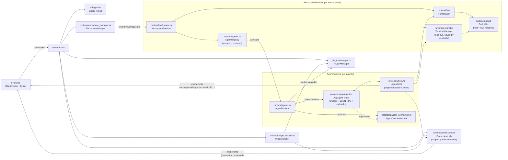

### 分层与职责（提纲挈领）

整个架构围绕**双向通讯**设计，Frontend 与 Agent 之间存在两条独立的数据流：

**出站（用户操作 → Agent）**：Frontend 通过 Command 同步调用 → commands 层参数校验与路由 → runtime 层找到对应的 WorkspaceRuntime 与 AgentRuntime → 通过 `AgentConnection` trait 调用协议实现（如 AcpAgent）→ 最终到达 Agent 子进程。Command 同步返回 Bridge Type 给 Frontend。

**入站（Agent 推送 → 用户）**：Agent 子进程发送 JSON-RPC notification/callback → 协议实现（AcpAgent）接收并调用 `AgentHost` trait 的方法 → AgentHost 由 runtime 层实现，负责调用能力层子模块（PermissionHub/TerminalManager/FsManager）并 emit 事件 → Frontend 收到异步推送。入站流程不经过 commands 层。

**核心抽象边界**：`AgentConnection`（runtime 调用协议层的唯一接口）与 `AgentHost`（协议层回调 runtime 的唯一接口）。这两个 trait 将"产品业务逻辑"与"协议实现细节"彻底隔离，使得 runtime 层完全不感知 ACP/MCP 等协议差异。

- **API 层（前端入口）**
  - `src-tauri/src/commands/*`：定义 command surface；只做参数校验、路由到 runtime（workspace/agent/permission/terminal）、返回 Bridge Types；不承载复杂运行态。
  - `src-tauri/src/bindings.rs`：用 tauri-specta 汇总 commands 并导出 TS bindings（前端只通过 bindings 调用）。
  - `src-tauri/capabilities/*.json`：Tauri v2 权限 allowlist（编译时安全白名单）。每个 JSON 文件定义特定窗口（`windows`）在特定平台（`platforms`）可调用的能力（`permissions`）。新增自定义 command 时需在对应窗口的 capability 文件中添加 `"allow-<command-name>"`；新增 event 订阅时需确保 `core:event:default` 或更细粒度的 event 权限已包含。若未同步，前端调用/订阅将在运行时被 Tauri 拒绝。

- **类型层（稳定 API 面）**
  - `src-tauri/src/api/types.rs`：Bridge Types（commands 返回值 + events payload）；把“ACP 协议复杂度”隔离在 Rust 内部，对前端提供稳定、可归并的事件/返回结构。
  - `src-tauri/src/types.rs`：现有的应用共享类型与校验（如 preferences/recovery）；与 ACP Bridge Types 分离，避免污染前端稳定 API 面。

- **运行时域（多 workspace 并行隔离的关键）**
  - `src-tauri/src/runtime/workspace_manager.rs`：`WorkspaceManager`（全局 State）；按 `workspaceId` 路由到对应 `WorkspaceRuntime`；不同 workspace 的权限队列/终端/fs/agent 运行态在结构上隔离。
  - `src-tauri/src/runtime/workspace.rs`：`WorkspaceRuntime`（单 workspace 容器）；持有该 workspace 的 `TerminalManager/FsManager/AgentRegistry`，并在需要时使用全局 `PermissionHub`。
  - `src-tauri/src/runtime/agents.rs`：
    - `AgentRecord`：workspace 内 agent 实体（指向某个 pluginId、可选 displayName/config）
    - `AgentRuntime`：该 agent 的运行态（懒启动后才存在），持有 `Arc<dyn AgentConnection>`（协议无关）与 session 状态
  - `src-tauri/src/runtime/plugin_installer.rs`：`PluginInstaller`（全局运行态调度者），负责 US-04 这类“需要 permission + 后台执行”的安装/升级流程：
    - commands 只做参数校验与路由；安装任务在 runtime 层 spawn 并 `await PermissionHub` 决策后调用 `PluginManager::install(...)`。

- **插件域（安装与状态）**
  - `src-tauri/src/plugins/manager.rs`：`PluginManager`，管理插件安装缓存与状态/更新检查（MVP：至少 installed/version/bin path）。
    - **Owner**：全局单例（Tauri `app.manage(...)`），与 `WorkspaceManager` 平级；所有 workspace 共享同一份插件缓存与状态。
    - **原则**：不在 app 启动时扫描/检查/安装；仅在用户操作（US-03/US-04）或 Agent 懒启动（US-06 的 `resolve_bin`）时按需工作。
    - **缓存约定**：`app_cache_dir()/plugins/<pluginId>/`（每个 pluginId 一个独立目录，避免重复安装与串版本）。

- **协议域（Protocol Domain：抽象 + ACP 实现）**
  - `src-tauri/src/protocols/agent_connection.rs`：定义 `AgentConnection` trait（上层与 Agent 交互的唯一抽象边界；协议无关）。
  - `src-tauri/src/protocols/host.rs`：定义 `AgentHost` trait（permission/fs/terminal/session_update 的回调与能力桥接；由 `runtime/*` 实现并负责 Tauri `emit`）。
  - `src-tauri/src/protocols/acp/agent.rs`：`AcpAgent` 实现 `AgentConnection`（内部封装 STDIO 子进程 + JSON-RPC 连接 + ACP client callbacks；不向上暴露 process/connection/delegate 细节）。

  **数据流示意**：
  ```
  ┌──────────────────────────────────────────────────────────────────┐
  │                        Runtime (AgentRuntime)                     │
  │  持有: Arc<dyn AgentConnection>                                   │
  │  实现: AgentHost                                                  │
  └───────────────────────────────┬──────────────────────────────────┘
                                  │
          ┌───────────────────────┼───────────────────────┐
          │ 调用                  │                       │ 回调
          ▼                       │                       ▼
  ┌───────────────────┐           │           ┌───────────────────────┐
  │ AgentConnection   │           │           │ AgentHost             │
  │ (trait)           │           │           │ (trait)               │
  │ - send_prompt     │           │           │ - on_session_update   │
  │ - cancel_turn     │           │           │ - request_permission  │
  │ - shutdown        │           │           │ - terminal_run/kill   │
  │                  │           │           │ - fs_read/write       │
  └───────────────────┘           │           └───────────────────────┘
          ▲                       │                       ▲
          │                       │                       │
          │ implements            │                       │ uses
          │                       │                       │
  ┌───────────────────────────────┴───────────────────────────────────┐
  │                         AcpAgent                                   │
  │  内部封装:                                                         │
  │  - STDIO 子进程（spawn adapter binary）                            │
  │  - JSON-RPC 连接                                                   │
  │  - ACP client callbacks                                            │
  │                                                                    │
  │  职责: 把 ACP 协议细节"翻译"成通用接口                              │
  └───────────────────────────────────────────────────────────────────┘
  ```

- **能力层（副作用执行，统一走 permission）**
  - `src-tauri/src/runtime/permissions.rs`：`PermissionHub`（全局，但按 scope 关联 workspace/agent/session/toolcall）；负责 permission 请求队列、emit `acp/permission_requested`、等待前端决策并返回给调用方（`AgentHost` 或 user action handler）。
  - `src-tauri/src/runtime/terminal.rs`：`TerminalManager`（每 workspace 一份、**支持并行多 terminalId**）；每次 one-shot command 都 spawn 独立子进程并绑定 `terminalId`，流式输出与退出按 `terminalId` emit `terminal/output`/`terminal/exited`；`AgentRuntime` 仅维护“归属/追踪”（如 `operationId -> terminalIds`），避免 stop/kill 误伤其他 agent 的执行。
  - `src-tauri/src/runtime/fs.rs`：`FsManager`（每 workspace 一份）；在 workspace root 边界内执行读写（本设计：fs.read 也需要 permission）；`AgentRuntime` 维护“归属/追踪”（如 `operationId -> fs ops`），实际 IO 仍以 workspace root 为边界。
  - `src-tauri/src/runtime/path.rs`：Path 工具；MVP 先覆盖“root 基准 join/normalize”，后续再统一补强 symlink/`..` 等安全校验策略。


### 模块清单（文件级索引）

> 下面每个用户故事都会引用这些模块；“修改列表”会指明需要新增/改动哪些文件与公开接口。

- `src-tauri/src/commands/*`：Tauri commands（前端入口）
- `src-tauri/src/api/types.rs`：Bridge Types（commands 返回值 + events payload）
- `src-tauri/src/runtime/workspace_manager.rs`：`WorkspaceManager`（全局 State，多 workspace）
- `src-tauri/src/runtime/workspace.rs`：`WorkspaceRuntime`（单 workspace 容器）
- `src-tauri/src/runtime/agents.rs`：`AgentRecord/AgentRuntime/AgentRegistry`
- `src-tauri/src/runtime/permissions.rs`：PermissionHub（scoped 队列 + oneshot 等待）
- `src-tauri/src/runtime/terminal.rs`：TerminalManager（每 workspace 终端执行/输出/退出/kill）
- `src-tauri/src/runtime/fs.rs`：FsManager（每 workspace 文件读写）
- `src-tauri/src/runtime/path.rs`：Path 工具（root/cwd 映射；后续补强）
- `src-tauri/src/plugins/manager.rs`：PluginManager（安装/状态/更新检查）
- `src-tauri/src/runtime/plugin_installer.rs`：PluginInstaller（安装/升级调度：PermissionHub + PluginManager）
- `src-tauri/src/protocols/agent_connection.rs`：`AgentConnection` trait（protocol boundary）
- `src-tauri/src/protocols/host.rs`：`AgentHost` trait（runtime ↔ protocol bridge）
- `src-tauri/src/protocols/acp/agent.rs`：`AcpAgent`（ACP 实现；内部封装 process + JSON-RPC + callbacks）
- `src-tauri/src/lib.rs`：`.setup()` 注入 `WorkspaceManager`
- `src-tauri/src/bindings.rs`：tauri-specta bindings 汇总
- `src-tauri/capabilities/*.json`：Tauri v2 capabilities allowlist（新增 command/event 时同步）

---

## 用户故事清单（MVP）

- US-01 创建 Workspace
- US-02 设置当前查看的 Workspace（Focus，可选持久化）
- US-03 检查插件安装/更新状态（是否安装 / 是否有更新）
- US-04 安装插件（缓存安装 + 权限确认）
- US-05 在 Workspace 下创建 Agent（实体，不启动）
- US-06 首条消息触发 Agent 懒启动（spawn/initialize/new_session）
- US-07 发送 Prompt 并流式展示回复（session/update）
- US-08 Agent 请求执行 Terminal（permission → run → output/exited）
- US-09 用户 Stop Terminal
- US-10 Agent 请求读取文件（permission → read）
- US-11 Agent 请求写入文件（permission → write）
- US-12 用户 Stop Turn（停止当前轮）
- US-13 多 Workspace 并行（不串台验收场景）

---

## US-01 创建 Workspace

### Rust 模块
- `src-tauri/src/commands/workspaces.rs`
- `src-tauri/src/runtime/workspace_manager.rs`
- `src-tauri/src/runtime/workspace.rs`
- `src-tauri/src/runtime/path.rs`
- `src-tauri/src/api/types.rs`

### Commands（前端入口）
- `workspace_create(rootDir: String) -> Result<WorkspaceSummary, ApiError>`

### 返回/通知边界
- 返回 `WorkspaceSummary { workspaceId, rootDir, createdAtMs }`
- MVP：不强制 emit 事件（可仅依赖返回值）

### 模块修改列表（实现时）
- `src-tauri/src/api/types.rs`
  - 新增：`WorkspaceSummary`、`ApiError::InvalidInput/IoError`
- `src-tauri/src/runtime/path.rs`
  - 新增：`canonicalize_workspace_root(root) -> Result<PathBuf, WorkspacePathError>`（MVP：存在 + canonicalize）
- `src-tauri/src/runtime/workspace.rs`
  - 新增：`WorkspaceRuntime::new(workspace_id, root_dir, ...)`
- `src-tauri/src/runtime/workspace_manager.rs`
  - 新增：`create_workspace(root_dir) -> WorkspaceSummary`
  - 存储：`HashMap<WorkspaceId, Arc<WorkspaceRuntime>>`
- `src-tauri/src/commands/workspaces.rs`
  - 新增 command handler：调用 `WorkspaceManager::create_workspace`
- `src-tauri/src/lib.rs`
  - `.setup()`：`app.manage(WorkspaceManager::new(...))`
- `src-tauri/src/bindings.rs` + `src-tauri/src/commands/mod.rs`（或 domain 分拆后的 mod）
  - 汇总/导出 command
- `src-tauri/capabilities/default.json`
  - allowlist：新增 `workspace_create`

### 时序图（到 Rust 返回为止）
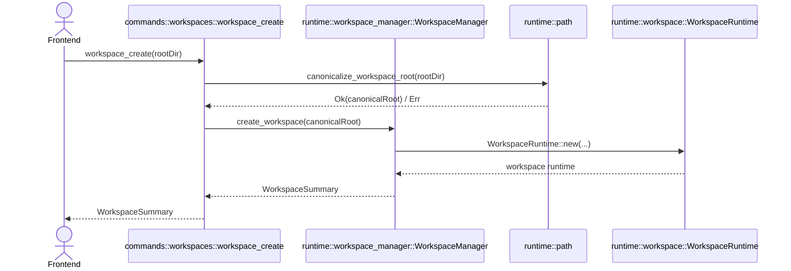

---

## US-02 设置当前查看的 Workspace（Focus，可选持久化）

> 说明：workspace 并行运行不等于 UI 不需要“当前查看对象”。Focus 只影响 UI 展示与用户交互路由；不改变后端并行模型。

### Rust 模块
- （可选）`src-tauri/src/runtime/workspace_manager.rs`
- `src-tauri/src/commands/workspaces.rs`
- `src-tauri/src/api/types.rs`

### Commands
- 方案 A（纯前端）：不需要 Rust command（MVP 更简单）
- 方案 B（可持久化/多窗口一致）：`workspace_set_focus(workspaceId) -> Result<(), ApiError>`
  - （可选）`workspace_get_focus() -> Result<Option<WorkspaceId>, ApiError>`

### 返回/通知边界
- 返回 `()` 或 `workspaceId`
- （可选）emit `acp/workspace_focus_changed`（多窗口需要时再加）

### 模块修改列表（方案 B）
- `src-tauri/src/runtime/workspace_manager.rs`
  - 新增：`focused_workspace_id: Option<WorkspaceId>`
  - 新增：setter/getter
- `src-tauri/src/api/types.rs`
  - 若需要：新增 `WorkspaceFocusChangedEvent`
- `src-tauri/src/commands/workspaces.rs`
  - 新增：`workspace_set_focus`
- `src-tauri/capabilities/default.json`
  - allowlist：新增 focus commands

### 时序图（方案 B）
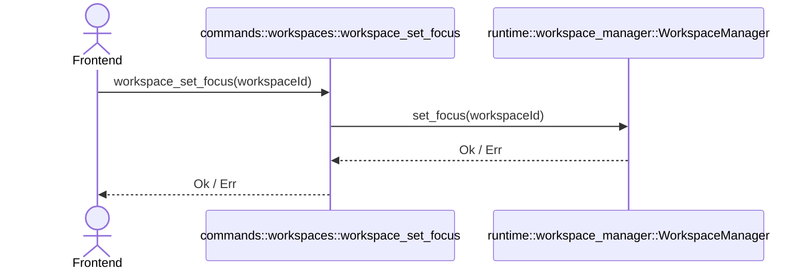

---

## US-03 检查插件安装/更新状态

### Rust 模块
- `src-tauri/src/commands/plugins.rs`
- `src-tauri/src/plugins/manager.rs`
- `src-tauri/src/api/types.rs`

### Commands
- `plugin_get_status(pluginId: String, checkUpdates: bool) -> Result<PluginStatus, ApiError>`

### 返回/通知边界
- 返回 `PluginStatus { pluginId, installed, installedVersion?, latestVersion?, updateAvailable?, binPath? }`
- MVP：`checkUpdates=false` 时只返回 installed + installedVersion/binPath
  - 设计说明：`checkUpdates=true` 可能依赖网络；MVP 可采用“best-effort”，离线/失败时允许 `latestVersion/updateAvailable` 为空或返回可读错误（由 `ApiError` 表达）。

### 模块修改列表（实现时）
- `src-tauri/src/api/types.rs`
  - 新增：`PluginStatus`
- `src-tauri/src/plugins/manager.rs`
  - 新增：`get_status(plugin_id, check_updates) -> PluginStatus`
  - 约定：缓存目录 `app_cache_dir()/plugins/<pluginId>/`
  - 设计决策：`PluginManager::new(...)` 只创建实例与路径配置，不主动扫描/检查所有插件。
- `src-tauri/src/commands/plugins.rs`
  - 新增：`plugin_get_status`
- `src-tauri/capabilities/default.json`
  - allowlist：新增 `plugin_get_status`

### 时序图
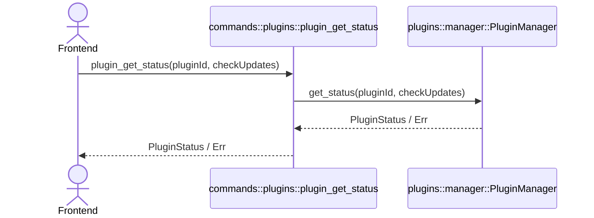

---

## US-04 安装插件（缓存安装 + 权限确认）

> 说明：需求要求“每次询问”。即使安装由用户点击触发，仍统一走 permission 队列（allow once / deny）。
>
> 设计口径（MVP）：**安装与更新统一为一个动作**。
>
> - 当插件未安装时：`plugin_install(pluginId, version=None)` 表示安装（默认最新或策略指定版本）
> - 当插件已安装时：`plugin_install(...)` 表示升级/切换版本（依然需要 permission）

### Rust 模块
- `src-tauri/src/commands/plugins.rs`
- `src-tauri/src/commands/permissions.rs`
- `src-tauri/src/plugins/manager.rs`
- `src-tauri/src/runtime/permissions.rs`
- `src-tauri/src/runtime/plugin_installer.rs`
- `src-tauri/src/api/types.rs`

### Commands
- `plugin_install(pluginId: String, version: Option<String>) -> Result<OperationStarted, ApiError>`
- `permission_respond(operationId: OperationId, decision: PermissionDecision) -> Result<(), ApiError>`（统一权限响应入口，见 US-08/10/11）

### 返回/通知边界
- `plugin_install`：立即返回 `OperationStarted { operationId }`
- emit：`acp/permission_requested`（source = user action / install plugin；本设计的 permission 事件名沿用技术需求文档）
- 安装进度（MVP 可简化）：完成后 emit `acp/plugin_status_changed`
  - origin 建议：安装插件并不必然属于某个 ACP toolcall，但建议 permission payload 支持可选 `origin.workspaceId`（用户在哪个 workspace 上下文触发安装）以便 UI 解释“作用范围”。

### 模块修改列表（实现时）
- `src-tauri/src/api/types.rs`
  - 新增：`PermissionRequestedEvent` 支持 `source`（`UserActionInstallPlugin`）与可选 `origin`（workspaceId/agentId/sessionId/toolCallId）
  - 新增：`PluginStatusChangedEvent`（或复用 `agent/status_changed`，但建议区分 plugin vs runtime）
- `src-tauri/src/runtime/permissions.rs`
  - 新增：`PermissionHub::request(operation) -> await decision`
  - 新增：`PermissionHub::respond(operationId, decision)`
- `src-tauri/src/plugins/manager.rs`
  - 新增：`install(pluginId, version) -> Result<()>`（执行 `npm install` 到 cache）
  - 设计决策：`install` 既用于首次安装也用于升级（同一 cache dir 下更新依赖/版本）。
- `src-tauri/src/runtime/plugin_installer.rs`
  - 新增：`PluginInstaller::start_install(pluginId, version, origin?) -> OperationStarted`
  - 行为：内部 spawn 后台任务，`await PermissionHub::request(...)`；allow 时调用 `PluginManager::install` 并 emit `acp/plugin_status_changed`
- `src-tauri/src/commands/plugins.rs`
  - 新增：`plugin_install`（参数校验 → 路由到 `PluginInstaller::start_install` → 返回 `OperationStarted`）
- `src-tauri/src/commands/permissions.rs`
  - 新增：`permission_respond`（路由到 PermissionHub.respond）
- `src-tauri/capabilities/default.json`
  - allowlist：新增 install/permission response commands + 事件订阅权限（如有）

### 时序图（从 command 到通知边界）
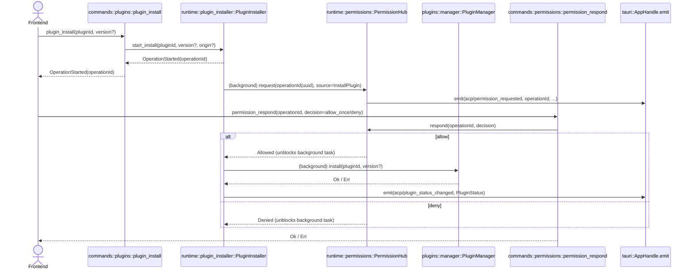

---

## US-05 在 Workspace 下创建 Agent（实体，不启动）

### Rust 模块
- `src-tauri/src/commands/agents.rs`
- `src-tauri/src/runtime/workspace_manager.rs`
- `src-tauri/src/runtime/workspace.rs`
- `src-tauri/src/runtime/agents.rs`
- `src-tauri/src/api/types.rs`

### Commands
- `agent_create(workspaceId: WorkspaceId, pluginId: String, displayName: Option<String>) -> Result<AgentSummary, ApiError>`

### 返回/通知边界
- 返回 `AgentSummary { agentId, workspaceId, pluginId, displayName }`
- （可选）emit `agent/status_changed`（status=Stopped）

### 模块修改列表（实现时）
- `src-tauri/src/api/types.rs`
  - 新增：`AgentSummary`
- `src-tauri/src/runtime/agents.rs`
  - 新增：`AgentRecord`（pluginId/displayName/...）
  - 新增：`AgentRegistry::create_agent(...) -> AgentSummary`
- `src-tauri/src/runtime/workspace.rs`
  - 存储：`agent_registry: AgentRegistry`
  - 新增：`create_agent(pluginId, displayName?) -> AgentSummary`（封装 workspace 内 agent_registry 的写操作）
- `src-tauri/src/runtime/workspace_manager.rs`
  - 新增：`get_workspace(workspaceId) -> Arc<WorkspaceRuntime>`
  - 新增：`create_agent(workspaceId, pluginId, displayName?) -> AgentSummary`（路由到对应 workspace runtime）
- `src-tauri/src/commands/agents.rs`
  - 新增：`agent_create`
- `src-tauri/capabilities/default.json`
  - allowlist：新增 `agent_create`

### 时序图
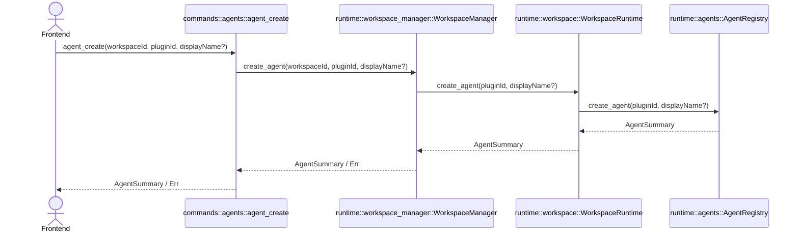

---

## US-06 首条消息触发 Agent 懒启动（spawn/initialize/new_session）

> 入口设计：不提供显式 “startAgent” command；由 `chat_send_prompt` 在需要时自动启动（lazy start）。
>
> 设计决策（MVP）：Agent 懒启动只做 `resolve_bin(pluginId)`，**不会隐式安装/更新插件**。
> 如果插件未安装，应返回 `ApiError::PluginNotInstalled`（或等价错误），由前端引导用户走 US-04。

### Rust 模块
- `src-tauri/src/commands/chat.rs`
- `src-tauri/src/runtime/workspace_manager.rs`
- `src-tauri/src/runtime/workspace.rs`
- `src-tauri/src/runtime/agents.rs`
- `src-tauri/src/plugins/manager.rs`
- `src-tauri/src/protocols/agent_connection.rs`
- `src-tauri/src/protocols/host.rs`
- `src-tauri/src/protocols/acp/agent.rs`
- `src-tauri/src/api/types.rs`

### Commands
- `chat_send_prompt(workspaceId, agentId, prompt) -> Result<SendPromptAck, ApiError>`
  - `SendPromptAck` 至少包含 `sessionId`（前端归并流式事件需要）

### 返回/通知边界
- 返回：`SendPromptAck { sessionId }`
- emit：`agent/status_changed`（Starting/Running/Errored）
- 后续流式：见 US-07（`acp/session_update`）

### 模块修改列表（实现时）
- `src-tauri/src/api/types.rs`
  - 新增：`SendPromptAck`
  - 新增/扩展：`AgentRuntimeStatus`（Starting/Running/Errored）
- `src-tauri/src/protocols/agent_connection.rs`
  - 定义核心 trait：`AgentConnection`（`send_prompt / cancel_turn / shutdown`）
- `src-tauri/src/protocols/host.rs`
  - 定义 `AgentHost`（permission/fs/terminal/session_update 回调与事件 emit）；由 `runtime/*` 实现
- `src-tauri/src/protocols/acp/agent.rs`
  - `AcpAgent` 实现 `AgentConnection`：内部完成 spawn → initialize → new_session，并在 ACP callbacks 中调用 `AgentHost`
- `src-tauri/src/runtime/workspace_manager.rs`
  - 新增：`ensure_agent_runtime(workspaceId, agentId) -> AgentRuntimeHandle`（路由到对应 workspace runtime）
- `src-tauri/src/runtime/workspace.rs`
  - 新增：`ensure_agent_runtime(agentId) -> AgentRuntimeHandle`（封装 workspace 内 agent registry 的 ensure）
- `src-tauri/src/runtime/agents.rs`
  - 新增：`AgentRegistry::ensure_runtime(agentId, workspace_ctx) -> AgentRuntimeHandle`
  - 新增：`AgentRuntime::ensure_started() -> Result<SessionId, ApiError>`（幂等：已启动则复用；未启动则 resolve_bin + connect）
  - 运行态持有：`Arc<dyn AgentConnection>`、`sessionId`、`status`（上层不再感知 process/connection/delegate）
  - 补充约定：`AgentHost` 实例由 runtime 创建并持有（推荐：`AgentRuntime` 自身实现 `AgentHost`，并在 `ensure_started` 时传入 `Arc<dyn AgentHost>` 给 `AcpAgent::connect(...)`）
    - `AgentHost` 实现必须绑定 workspace 上下文：workspace root + `Arc<FsManager>` + `Arc<TerminalManager>` + `PermissionHub` + `tauri::AppHandle`
    - 该约定用于保证 US-08/10/11 的能力调用不会“跨 workspace 串台”，且协议实现层无需持有 `workspaceId/agentId`
- `src-tauri/src/plugins/manager.rs`
  - 新增：`resolve_bin(pluginId) -> Result<AdapterCommand, ApiError>`（找到可执行入口）
  - 行为约束：未安装时返回可匹配的 typed error（例如 `PluginNotInstalled { pluginId }`），不触发任何安装行为。
- `src-tauri/src/commands/chat.rs`
  - `chat_send_prompt` 内部：workspace 路由 → `WorkspaceManager::ensure_agent_runtime` → `AgentRuntime::ensure_started` → `AgentRuntime::send_prompt`（见 US-07）

### 时序图（懒启动部分）
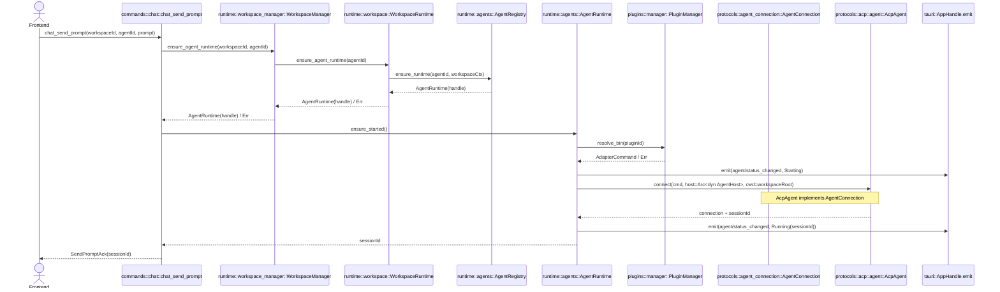

---

## US-07 发送 Prompt 并流式展示回复（session/update）

### Rust 模块
- `src-tauri/src/commands/chat.rs`
- `src-tauri/src/runtime/agents.rs`
- `src-tauri/src/protocols/agent_connection.rs`
- `src-tauri/src/protocols/host.rs`
- `src-tauri/src/protocols/acp/agent.rs`
- `src-tauri/src/api/types.rs`

### Commands
- `chat_send_prompt(...) -> Result<SendPromptAck, ApiError>`（延续 US-06）

### 返回/通知边界
- command 返回 `SendPromptAck { sessionId }`
- 流式通知：`acp/session_update`（payload 必带 `workspaceId + agentId + sessionId`）

### 模块修改列表（实现时）
- `src-tauri/src/api/types.rs`
  - 定义：`AcpSessionUpdateEvent`、`AcpSessionUpdate`（chunk/toolcall/plan/unknown）
- `src-tauri/src/runtime/agents.rs`
  - 新增：`AgentRuntime::send_prompt(sessionId, text) -> Result<()>`（内部调用 `AgentConnection::send_prompt`）
- `src-tauri/src/protocols/host.rs`
  - 实现：`on_session_update(sessionId, update)` → 转 bridge → emit `acp/session_update`
- `src-tauri/src/protocols/acp/agent.rs`
  - 在 ACP callbacks 中接收 `session_notification(update)` 并转交给 `AgentHost::on_session_update(...)`
- `src-tauri/src/protocols/agent_connection.rs`
  - `send_prompt(sessionId, text)`（协议无关接口；ACP 实现内部映射到 `session/prompt`）

### 时序图（到 emit 为止）
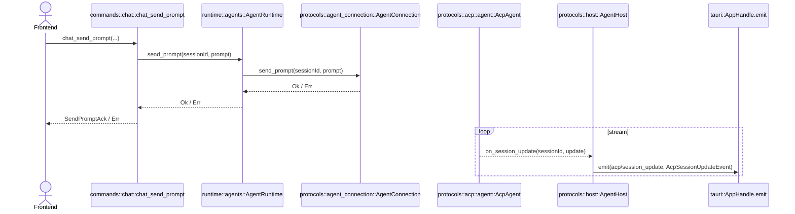

---

## US-08 Agent 请求执行 Terminal（permission → run → output/exited）

> 本用户故事的“前端入口 command”从 **响应权限**开始：前端先收到 `acp/permission_requested`，用户点击允许/拒绝后调用 `permission_respond`。
>
> 注：`AgentHost` 的 runtime 实现必须绑定 workspace 上下文（workspace root + `TerminalManager/FsManager`，见 US-06），因此协议层不需要、也不应该传递 `workspaceId/agentId` 来定位能力管理器。

### Rust 模块
- `src-tauri/src/protocols/host.rs`
- `src-tauri/src/protocols/acp/agent.rs`
- `src-tauri/src/runtime/permissions.rs`
- `src-tauri/src/runtime/terminal.rs`
- `src-tauri/src/api/types.rs`
- `src-tauri/src/commands/permissions.rs`（permission respond）

### Commands
- `permission_respond(operationId, decision) -> Result<(), ApiError>`

### 返回/通知边界
- emit：`acp/permission_requested`（由 PermissionHub 发出；AcpAgent 仅通过 AgentHost 发起 permission request）
- emit：`terminal/output`（stdout/stderr chunk）
- emit：`terminal/exited`（exit_code/user_stopped）
- 同时：`acp/session_update` 会包含 toolcall 状态更新（由 adapter 发回）

### 模块修改列表（实现时）
- `src-tauri/src/api/types.rs`
  - 定义：`AcpPermissionRequestedEvent`、`TerminalOutputEvent`、`TerminalExitedEvent`
- `src-tauri/src/runtime/permissions.rs`
  - `PermissionHub::request(operation) -> await decision`
  - `PermissionHub::respond(operationId, decision)`
- `src-tauri/src/protocols/host.rs`
  - 定义：`request_permission(...) -> await decision`（由 runtime 实现；内部通过 `PermissionHub` emit `acp/permission_requested` 并等待前端回应）
- `src-tauri/src/protocols/acp/agent.rs`
  - 在 ACP 回调 `request_permission` 中：调用 `AgentHost::request_permission(...)` → await decision → 回传 ACP 许可结果（AllowOnce / Deny）
- `src-tauri/src/runtime/terminal.rs`
  - `run(command_string, cwd=root, origin={workspaceId, agentId, operationId}) -> terminalId`（origin 由 runtime/host 实现层附加，协议层不传业务 ID）
  - 采集输出并 emit `terminal/output`
  - 退出时 emit `terminal/exited`
- `src-tauri/src/commands/permissions.rs`
  - `permission_respond`：路由到 PermissionHub.respond

### 时序图（到 emit/ACP response 为止）
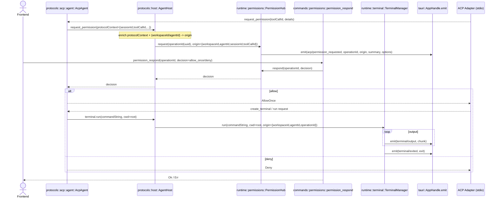

---

## US-09 用户 Stop Terminal

### Rust 模块
- `src-tauri/src/commands/terminal.rs`
- `src-tauri/src/runtime/workspace_manager.rs`
- `src-tauri/src/runtime/workspace.rs`
- `src-tauri/src/runtime/terminal.rs`
- `src-tauri/src/api/types.rs`

### Commands
- `terminal_kill(workspaceId, terminalId) -> Result<(), ApiError>`

### 返回/通知边界
- 返回 `()`
- emit `terminal/exited(user_stopped=true)`（若尚未退出）

### 模块修改列表（实现时）
- `src-tauri/src/runtime/terminal.rs`
  - `kill(terminalId) -> Result<()>`（标记 user_stopped）
- `src-tauri/src/commands/terminal.rs`
  - 新增 `terminal_kill`

### 时序图
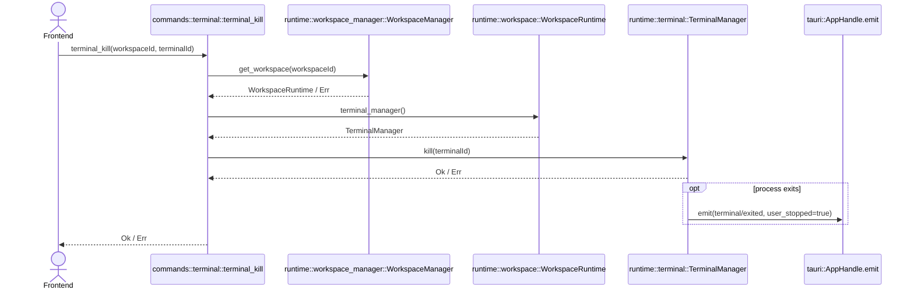

---

## US-10 Agent 请求读取文件（permission → read）

> 注：同 US-06，`AgentHost` 的 runtime 实现已绑定 workspace 上下文（workspace root + `FsManager`），因此协议层不需要、也不应该传递 `workspaceId/agentId` 来定位文件系统管理器。

### Rust 模块
- `src-tauri/src/protocols/host.rs`
- `src-tauri/src/protocols/acp/agent.rs`
- `src-tauri/src/runtime/permissions.rs`
- `src-tauri/src/runtime/fs.rs`
- `src-tauri/src/runtime/path.rs`
- `src-tauri/src/api/types.rs`
- `src-tauri/src/commands/permissions.rs`（permission respond）

### Commands
- `permission_respond(...) -> Result<(), ApiError>`（同 US-08）

### 返回/通知边界
- emit：`acp/permission_requested`（source=fs.read）
- fs.read 的结果通过 ACP 返回给 adapter；前端可通过后续 `acp/session_update`（toolcall completed）看到摘要

### 模块修改列表（实现时）
- `src-tauri/src/protocols/host.rs`
  - `fs.read` 回调前也走 PermissionHub（本文件口径）；运行时负责 emit `acp/permission_requested`
- `src-tauri/src/runtime/fs.rs`
  - `read_text_file(path) -> String`
- `src-tauri/src/runtime/path.rs`
  - MVP：`resolve_path_in_workspace(root, input) -> PathBuf`（后续增强 symlink/..）

### 时序图
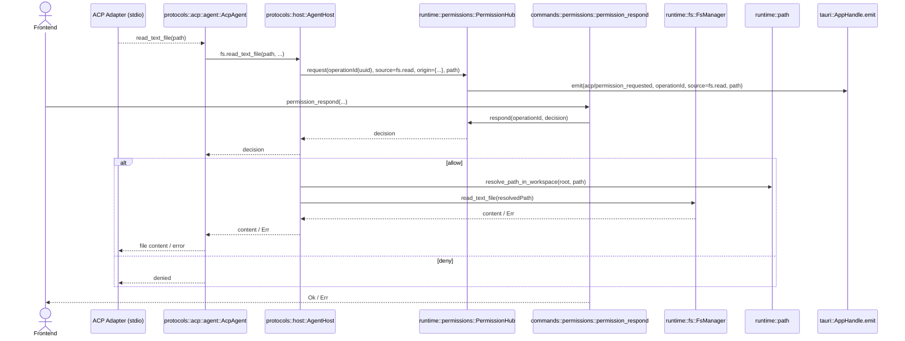

---

## US-11 Agent 请求写入文件（permission → write）

> 注：同 US-06，`AgentHost` 的 runtime 实现已绑定 workspace 上下文（workspace root + `FsManager`），因此协议层不需要、也不应该传递 `workspaceId/agentId` 来定位文件系统管理器。

### Rust 模块
- `src-tauri/src/protocols/host.rs`
- `src-tauri/src/protocols/acp/agent.rs`
- `src-tauri/src/runtime/permissions.rs`
- `src-tauri/src/runtime/fs.rs`
- `src-tauri/src/runtime/path.rs`
- `src-tauri/src/api/types.rs`
- `src-tauri/src/commands/permissions.rs`

### Commands
- `permission_respond(...) -> Result<(), ApiError>`

### 返回/通知边界
- emit：`acp/permission_requested`（source=fs.write，包含 path + content 摘要）
- 写入结果通过 ACP 返回给 adapter；前端通过 toolcall update 看到完成/失败

### 模块修改列表（实现时）
- `src-tauri/src/runtime/fs.rs`
  - `write_text_file(path, content) -> Result<()>`（MVP 可先非原子，后续再原子化）
- `src-tauri/src/runtime/path.rs`
  - `resolve_write_target_in_workspace(root, input)`（目标不存在时的校验策略，后续补强）
- `src-tauri/src/protocols/host.rs`
  - fs.write 回调：permission → path 校验 → write → ACP response（由运行时实现；ACP 实现只调用 `AgentHost`）

### 时序图
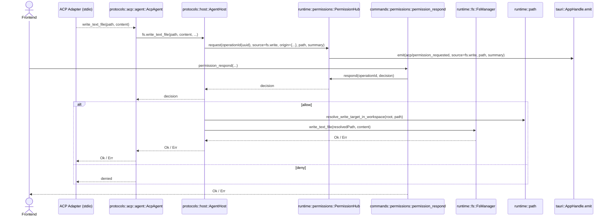

---

## US-12 用户 Stop Turn（停止当前轮）

### Rust 模块
- `src-tauri/src/commands/chat.rs`
- `src-tauri/src/runtime/workspace_manager.rs`
- `src-tauri/src/runtime/workspace.rs`
- `src-tauri/src/runtime/agents.rs`
- `src-tauri/src/protocols/agent_connection.rs`
- `src-tauri/src/api/types.rs`

### Commands
- `chat_stop_turn(workspaceId, agentId, sessionId) -> Result<(), ApiError>`

### 返回/通知边界
- 返回 `()`
- （可选）emit `acp/turn_stopped`（MVP 可先不发，前端以本地状态标记）

### 模块修改列表（实现时）
- `src-tauri/src/protocols/agent_connection.rs`
  - 定义：`cancel_turn(sessionId)`（协议无关接口；ACP 实现内部映射到 cancel/stop turn 能力）
- `src-tauri/src/runtime/agents.rs`
  - 新增：`AgentRuntime::stop_turn(sessionId) -> Result<()>`（内部调用 `AgentConnection::cancel_turn`）
- `src-tauri/src/runtime/workspace.rs`
  - 新增：`stop_turn(agentId, sessionId) -> Result<()>`（封装 workspace 内查找 agent runtime 并停止当前轮）
- `src-tauri/src/runtime/workspace_manager.rs`
  - 新增：`stop_turn(workspaceId, agentId, sessionId) -> Result<()>`（路由到对应 workspace runtime）
- `src-tauri/src/commands/chat.rs`
  - 新增 `chat_stop_turn`（参数校验 → 路由到 `WorkspaceManager::stop_turn`）

### 时序图
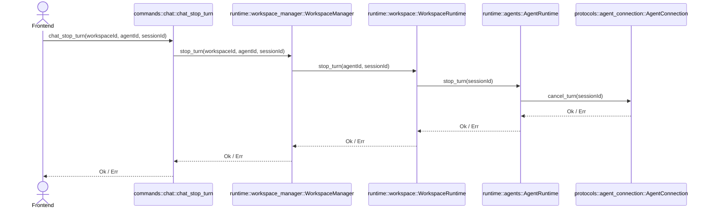

---

## US-13 多 Workspace 并行（不串台验收场景）

> 这是跨用户故事的验收：并行运行不靠“切换”，而靠 **每个 workspace 独立 runtime + 所有事件携带 workspaceId**。

### Rust 模块
- `src-tauri/src/runtime/workspace_manager.rs`
- `src-tauri/src/runtime/workspace.rs`
- `src-tauri/src/runtime/agents.rs`
- `src-tauri/src/runtime/permissions.rs`
- `src-tauri/src/runtime/terminal.rs`
- `src-tauri/src/runtime/fs.rs`
- `src-tauri/src/api/types.rs`
- `src-tauri/src/protocols/agent_connection.rs`
- `src-tauri/src/protocols/host.rs`
- `src-tauri/src/protocols/acp/agent.rs`

### Commands（参与者）
- `workspace_create` / `agent_create` / `chat_send_prompt`
- `permission_respond` / `terminal_kill` / `chat_stop_turn`

### 返回/通知边界
- 所有事件 payload 必带 `workspaceId`
- TerminalManager/FsManager 必须**按 workspace 实例隔离**
- PermissionHub 必须支持“按 origin scope 路由/归并”，并保证 `operationId` 全局唯一（uuid）

### 模块修改列表（实现时）
- `src-tauri/src/runtime/workspace_manager.rs`
  - 所有入口以 `workspaceId` 定位 `WorkspaceRuntime`
- `src-tauri/src/runtime/workspace.rs`
  - runtime 内部状态不跨 workspace 共享（terminal/fs/agent registry）
- `src-tauri/src/runtime/agents.rs`
  - 不同 workspace 的 agent runtimes 必须物理隔离（map 挂在 WorkspaceRuntime 下）
- `src-tauri/src/runtime/permissions.rs`
  - 统一 operationId（uuid）+ origin（workspaceId/agentId/sessionId/toolCallId）保证不串台
- `src-tauri/src/api/types.rs`
  - 所有事件结构强制包含 `workspaceId`（或在 origin 中包含）

### 时序图（并行示意）
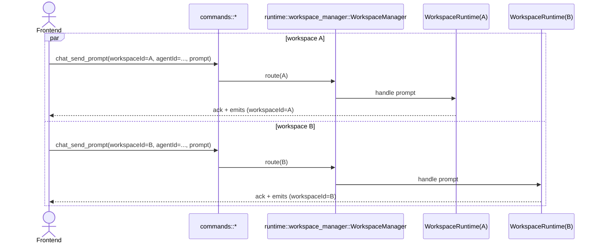

---

## 待你确认的接口命名（下一轮逐条确认）

为了避免后续反复改名，建议你逐条确认以下命名与参数：

1. Workspace：`workspace_create` 返回 `WorkspaceSummary` 还是仅 `workspaceId`？
2. Focus：US-02 采用“纯前端”还是“Rust 持久化 focus”？
3. Plugin：`pluginId` 的命名是否固定为 UI 词（不暴露 ACP/adapter 细节）？
4. Agent：`agent_create` 的参数最小集（是否需要 `displayName` / `config`）？
5. Prompt：`chat_send_prompt` 是否返回 `sessionId`（建议返回；多 agent 场景需要）？
6. Permission：是否接受 `permission_respond(operationId, decision)`（只靠 operationId 路由），还是需要额外携带 `workspaceId` 做校验？
